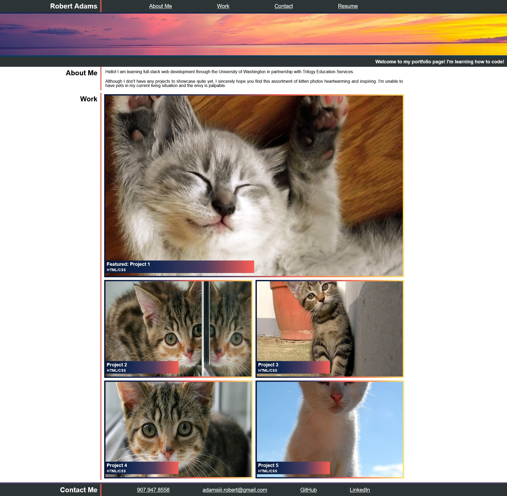

# Portfolio

## Description
This project showcases what I've learned so far in my coding bootcamp by applying fundamental HTML and CSS concepts. Utilizing a flexbox layout method simplifies mobile responsiveness for the developer, and mobile responsiveness improves the accessibility of the web application. Creating a portfolio this early into my web development career provides a foundation for future skill application as well as a gallery to demonstrate past work.

## Usage

Click on the screenshot to launch the application!

    
## Acknowledgements

Big thank you to these resources:

https://www.freecodecamp.org/news/an-animated-guide-to-flexbox-d280cf6afc35/

https://css-tricks.com/snippets/css/a-guide-to-flexbox/

https://flexboxfroggy.com/

https://developer.mozilla.org/en-US/docs/Learn/CSS/CSS_layout/Flexbox

Shout out to coding-boot-camp for this [template](https://coding-boot-camp.github.io/full-stack/github/professional-readme-guide)

