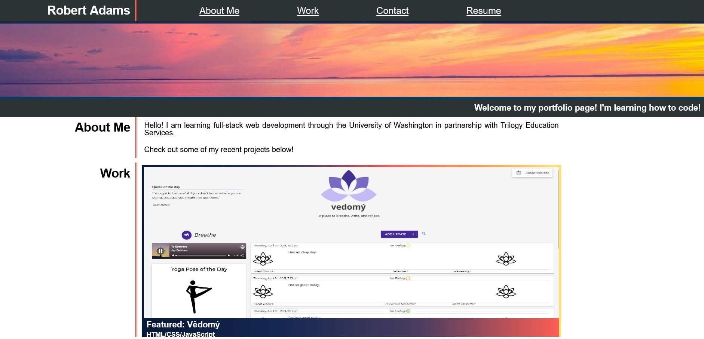

  
# Portfolio

## Description

This project showcases what I've learned so far in my coding bootcamp by applying fundamental HTML and CSS concepts. Utilizing a flexbox layout method simplifies mobile responsiveness for the developer, and mobile responsiveness improves the accessibility of the web application. Creating a portfolio this early into my web development career provides a foundation for future skill application as well as a gallery to demonstrate past work.

## Table of Contents

- [Usage](#Usage)
- [Questions](#Questions)
- [License](#License)

## Usage

Click the image below to check out my portfolio!

## Questions

Questions? Reach out to me:

GitHub: [comatosino](https://github.com/comatosino)

Email: adamsiii.robert@gmail.com

## License
    
This project is covered under the [MIT](https://opensource.org/licenses/MIT) license.
    
